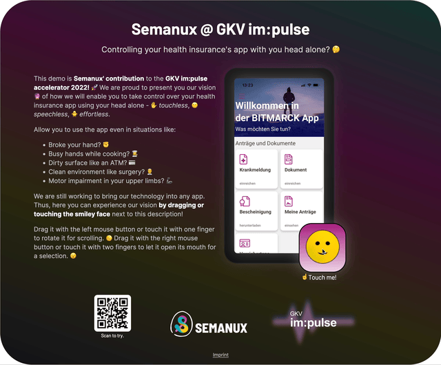

## Semanux @ GKV im:pulse

How could you use the smartphone applications by the Statutory Health Insurance Funds of Germany **just with your head** 🙃?
Experience the vision 🔮 by Semanux in a [_live demo_](https://gkv-impulse.semanux.com) on **your device** 📲!

This demo is a contribution of the Semanux team to the [GKV im:pulse accelerator](https://www.gkv-impulse.de).

### How to run locally

1. Install a recent [Node.js environment](https://nodejs.org).
1. Install [Git](https://git-scm.com/book/en/v2/Getting-Started-Installing-Git).
1. Clone this repository via terminal `git clone https://github.com/semanux/gkv-impulse.git --recursive`.
1. Navigate into the directory via `cd gkv-impulse`.
1. Install dependencies via `npm install`.
1. Run locally via `npm run dev`.
